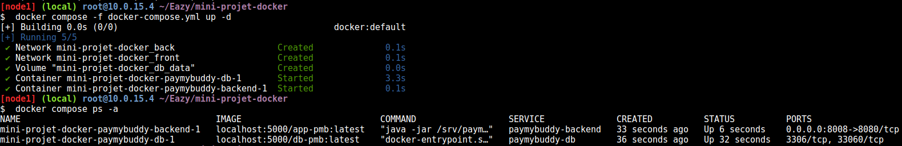

# BUILD YOUR IMAGES
## Build your database image :
> **$>** docker build --target db -t db-pmb .

## Build your app image :
> **$>** docker build --target app -t app-pmb .

## Upload your images to your repository
:warning: **replace "localhost:5000" by your registry URL if needed**

> **$>** docker tag db-pmb:latest localhost:5000/db-pmb:latest
**\$>** docker tag app-pmb:latest localhost:5000/app-pmb:latest

> **$>** docker push localhost:5000/db-pmb:latest
**\$>** docker push localhost:5000/app-pmb:latest

## Deploy your PayMyBuddy instance :
Fill in the startup/db_root_pwd.txt and startup/pmb_pwd.txt with the passwords you will use for managing the DBMS and the app database.
Add the password contained in startup/pmb_pwd.txt in the startup/.env file.

> **$>**  docker compose -f docker-compose.yml up -d

# Enjoy your application
Take a look at http://<YOUR_DEPLOYMENT_IP>:8008
### Here is a whole new world

### You can connect to your buddies...

### Pay them (and get paid :smiley: )

### Make deposits or get your money

